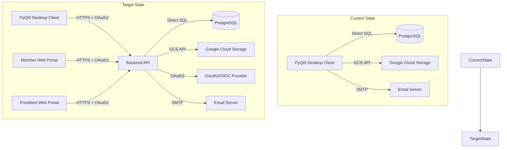

# eSpeleo Code Audit Summary

**Date:** 2026-07-16  
**Auditor:** AI Assistant  
**Scope:** Full codebase review of the eSpeleoSociety desktop application and backend skeleton

---

## Executive Summary

eSpeleoSociety is a PyQt5 desktop administration client for managing a caving organization's members, clubs, membership fees, and electronic membership cards (eCP). The system is in a **transitional state** — currently using direct PostgreSQL access from the desktop client, with a documented migration path toward an API/OAuth2 backend architecture.

### Overall Assessment

| Category | Status | Notes |
|----------|--------|-------|
| **Core Functionality** | ✅ Working | Club/member CRUD, fee tracking, SEPA import, eCP issuance |
| **Architecture** | ⚠️ Transitional | Direct DB access should move to backend |
| **Security** | 🔴 Needs Attention | Several critical issues documented |
| **Code Quality** | ✅ Good | Well-structured, documented, tested |
| **Test Coverage** | ✅ Good | 100+ unit tests, integration tests available |
| **Documentation** | ✅ Excellent | Comprehensive technical manuals and API docs |

---

## What Works Well ✅

### 1. Core Application Features

- **Desktop GUI** ([`main.py`](espeleo/main.py)): Application starts correctly, handles setup/PIN dialogs, navigation between views
- **Club Management** ([`views/clubs_list_view.py`](espeleo/views/clubs_list_view.py), [`dialogs/club_management_dialog.py`](espeleo/dialogs/club_management_dialog.py)):
  - List, create, edit, delete clubs
  - Inline editing with sorting and filtering
  - President assignment and club directory import
- **Member Management** ([`views/members_list_view.py`](espeleo/views/members_list_view.py), [`dialogs/member_management_dialog.py`](espeleo/dialogs/member_management_dialog.py)):
  - List members by club or global search
  - Create, edit, delete members
  - Club affiliation management with primary club support
  - Role-based sorting (presidents first)
- **Membership Fees** ([`db.py`](espeleo/db.py)):
  - Track payments per member/year/fee-type
  - SEPA camt.053 import with transaction classification
  - Idempotent fee record insertion
- **eCP (Electronic Card) System** ([`ecp_issuance.py`](espeleo/ecp_issuance.py), [`ecp_card.py`](espeleo/ecp_card.py), [`ecp_qr.py`](espeleo/ecp_qr.py)):
  - Ed25519-signed offline-verifiable QR codes
  - JPG/PDF card generation with embedded QR
  - Tokenized static verification pages
  - Google Wallet native barcode support (payload ready)
  - Email notifications with attachments
- **Portrait Management** ([`face_detection.py`](espeleo/face_detection.py)):
  - Photo upload with OpenCV face detection
  - Hash-based deduplication
  - Warning system for no-face-detected scenarios

### 2. Backend API Skeleton

- **WSGI Application** ([`backend/app.py`](espeleo/backend/app.py), [`backend/wsgi.py`](espeleo/backend/wsgi.py)):
  - `GET /api/v1/health` — public health check
  - `GET /api/v1/clubs` — paginated club listing with filtering
  - `GET /api/v1/clubs/{club_id}/members` — member listing with authorization
  - `GET /api/v1/me` — member portal profile
  - `POST /api/v1/me/ecp-requests` — member eCP request with photo upload
  - `PATCH /api/v1/members/{member_id}` — admin/president member updates
  - `GET /api/v1/ecp/verify/{token}` — public tokenized verification
- **Authentication** ([`backend/auth.py`](espeleo/backend/auth.py)):
  - JWT bearer token validation
  - RS256/JWKS support for production OIDC
  - HS256 fallback for development
  - Role extraction from multiple claim sources
  - Club-based authorization for `club_president` role
- **Pagination** ([`backend/pagination.py`](espeleo/backend/pagination.py)):
  - Keyset cursor pagination (ID-based and composite)
  - SQL-level filtering to avoid loading all records
- **Audit Logging** ([`backend/audit.py`](espeleo/backend/audit.py), [`db.py`](espeleo/db.py)):
  - Route-template audit events (no tokens logged)
  - Sanitized log output (PII redaction)

### 3. Database Design

- **Schema** ([`database/schema.sql`](espeleo/database/schema.sql)):
  - Proper foreign keys and indexes
  - CHECK constraints for status values
  - Unique indexes for eCP hashes
  - Partial indexes for primary club enforcement
- **Migrations** ([`database/migrations/`](espeleo/database/migrations/)):
  - Additive migrations for existing databases
  - ECP QR metadata, membership integrity, club directory contacts, eCP delivery/portraits
- **Transaction Support** ([`db.py`](espeleo/db.py)):
  - Context manager for multi-operation transactions
  - Proper rollback on errors

### 4. Testing

- **Test Suite** ([`tests/`](espeleo/tests/)):
  - 100+ unit tests passing
  - Backend API, auth, repository, WSGI tests
  - ECP issuance, QR signing, email notifications
  - SEPA processing, face detection, inline editing
  - Database schema validation
  - Integration tests (skipped without test DB)

### 5. Documentation

- **Technical Manual** ([`docs/technical-manual.md`](espeleo/docs/technical-manual.md)): 1152 lines covering architecture, flows, database, security
- **API Documentation** ([`docs/api/backend-api.md`](espeleo/docs/api/backend-api.md), [`docs/api/openapi.yaml`](espeleo/docs/api/openapi.yaml))
- **Migration Plan** ([`docs/api-oauth2-migration-plan.md`](espeleo/docs/api-oauth2-migration-plan.md))
- **ECP Signing Guide** ([`docs/ecp-signing.md`](espeleo/docs/ecp-signing.md))
- **Fix Log** ([`fix.md`](espeleo/fix.md)): Detailed changelog of all fixes
- **Code Audit** ([`CODE_AUDIT.md`](espeleo/CODE_AUDIT.md)): 25 detailed findings with severity ratings

---

## What Is OK ⚠️

### 1. Transitional Architecture

The current direct database access from desktop is **intentional and documented** as a transitional state:

- Desktop client stores encrypted secrets (DB password, GCS credentials, eCP signing key)
- Each admin workstation has full database access
- Migration to API/OAuth2 backend is planned and partially implemented

**Recommendation:** Continue backend migration as the next major phase.

### 2. Development Fallback Authentication

The backend uses HS256 with a shared secret when no JWKS URL is configured:

```python
# backend/auth.py
if self.jwks_client:
    self.algorithms = tuple(algorithms or ("RS256",))
else:
    if not jwt_secret:
        raise ValueError("jwt_secret is required when JWKS is not configured.")
    self.algorithms = tuple(algorithms or ("HS256",))
```

**This is acceptable for development** but must be addressed before production deployment.

### 3. Connection Management

Database connections are opened per-operation and rely on garbage collection:

```python
# db.py
def _fetch_all(self, query, params=None, conn=None):
    with self.get_connection() as owned_conn:
        # ...
```

**Acceptable for current load** but should use connection pooling for production API backend.

### 4. Static Verification Pages

ECP verification uses tokenized static HTML pages on Google Cloud Storage:

- Protection based on unguessable URL tokens
- `noindex`, `nofollow`, `noarchive` metadata
- No authentication or rate limiting

**Documented limitation** — true access control requires backend OAuth2.

---

## What Needs Improvement 🔴

### Critical Security Issues (Must Fix Before Production)

| # | Issue | Location | Risk |
|---|-------|----------|------|
| 1 | **HS256 fail-open in production** | [`backend/dev_server.py:25-45`](espeleo/backend/dev_server.py:25) | Attacker with shared secret can forge JWTs |
| 2 | **JWT without `exp` claim accepted** | [`backend/auth.py:55-61`](espeleo/backend/auth.py:55) | Tokens without expiration are valid forever |
| 3 | **Algorithm confusion risk** | [`backend/auth.py:42-48`](espeleo/backend/auth.py:42) | RS256/HS256 confusion attack possible |
| 4 | **Secrets written unencrypted to disk** | [`config.py:68-96`](espeleo/config.py:68) | Crash during encryption leaves plaintext secrets |
| 5 | **Weak key derivation** | [`utils.py`](espeleo/utils.py) | AES key is truncated `crypt_key` instead of PBKDF2 |
| 6 | **Deterministic birth date encryption** | [`db.py:865-884`](espeleo/db.py:865) | Same birth date = same ciphertext (zero IV) |
| 7 | **Decryption key on every client** | Architecture | Compromised admin PC = all member PII exposed |

### High Priority Bugs

| # | Issue | Location | Impact |
|---|-------|----------|--------|
| 9 | **Notifications checkbox ignored** | [`dialogs/ecp_issuance_dialog.py:170`](espeleo/dialogs/ecp_issuance_dialog.py:170) | `notifications_enabled=True` hardcoded |
| 10 | **Photo hash from UUID, not image** | [`dialogs/ecp_issuance_dialog.py:147`](espeleo/dialogs/ecp_issuance_dialog.py:147) | Breaks photo deduplication |
| 11 | **Cancel doesn't reset pending portrait** | [`dialogs/member_management_dialog.py:454-485`](espeleo/dialogs/member_management_dialog.py:454) | Cancelled photo gets saved later |
| 12 | **Silent failure on president lookup** | [`dialogs/club_management_dialog.py:304-317`](espeleo/dialogs/club_management_dialog.py:304) | President lost without UI warning |
| 13 | **X-Request-ID header case mismatch** | [`backend/wsgi.py:19-27`](espeleo/backend/wsgi.py:19) vs [`app.py:67`](espeleo/backend/app.py:67) | Request tracing broken in production |
| 14 | **TOCTOU race in eCP request** | [`backend/repository.py:334-403`](espeleo/backend/repository.py:334) | Duplicate pending requests possible |

### Medium Priority Issues

| # | Issue | Location | Impact |
|---|-------|----------|--------|
| 18 | **ECP issuance not atomic** | [`db.py:1060-1177`](espeleo/db.py:1060) | Partial issuance on failure |
| 19 | **Photo deletion without rollback** | [`dialogs/ecp_approval_dialog.py`](espeleo/dialogs/ecp_approval_dialog.py) | Orphaned photos on failure |
| 20 | **CASCADE delete on membership_fees** | [`database/schema.sql:264-266`](espeleo/database/schema.sql:264) | Fee history lost on eCP delete |
| 21 | **No UNIQUE constraint on members.email** | [`database/schema.sql`](espeleo/database/schema.sql) | Duplicate member emails allowed |
| 22 | **Incomplete migration docs** | [`database/README.md`](espeleo/database/README.md) | Missing 2 of 4 migrations documented |
| 23 | **No explicit connection close** | [`db.py`](espeleo/db.py) | Connection exhaustion risk |
| 24 | **Migration without transaction** | [`2026-06-28-membership-integrity.sql`](espeleo/database/migrations/2026-06-28-membership-integrity.sql) | Partial migration on failure |

---

## Recommended Fix Priority

### Phase 1: Security Hardening (Before Any Production Use)

1. **Fix auth fail-open** (#1-3):
   - Require JWKS URL in production
   - Enforce `exp` claim in JWT validation
   - Validate algorithm matches key type

2. **Fix secrets handling** (#4-5):
   - Write to encrypted temp file from start
   - Use PBKDF2 for key derivation
   - Add HMAC for integrity

3. **Fix birth date encryption** (#6):
   - Use `pgp_sym_encrypt` with random IV
   - Or use proper AES-GCM mode

4. **Plan key management migration** (#7):
   - Move decryption to backend only
   - Desktop receives only decrypted data over HTTPS

### Phase 2: Bug Fixes (Before Next Release)

1. **Fix eCP dialog bugs** (#9, #10, #11)
2. **Fix club president bug** (#12)
3. **Fix WSGI header case** (#13)
4. **Add transaction to eCP request** (#14)

### Phase 3: Data Integrity (Next Sprint)

1. **Make eCP issuance atomic** (#18)
2. **Add email uniqueness constraint** (#21)
3. **Fix CASCADE delete behavior** (#20)
4. **Document all migrations** (#22)

### Phase 4: Production Hardening

1. **Add connection pooling**
2. **Add rate limiting for public endpoints**
3. **Add idempotency keys**
4. **Implement real Google Wallet API**
5. **Complete OAuth2/OIDC login flows**

---

## Architecture Diagram



---

## File Structure Summary

```
espeleo/
├── main.py                    # Application entry point
├── setup.py                   # Secrets setup dialog
├── config.py                  # Encrypted secrets management
├── db.py                      # Database access layer
├── utils.py                   # Utility functions (encryption, GCS, etc.)
├── api_client.py              # Future API client abstraction
├── model/                     # Data models
│   ├── member.py
│   ├── club.py
│   ├── membership.py
│   ├── ecp.py
│   └── ecp_request.py
├── views/                     # PyQt5 views
│   ├── clubs_list_view.py
│   ├── members_list_view.py
│   ├── member_search_view.py
│   ├── ecp_requests_view.py
│   ├── sepa_import_view.py
│   ├── notifications_view.py
│   ├── settings_view.py
│   └── reporting_view.py
├── dialogs/                   # Dialog windows
│   ├── club_management_dialog.py
│   ├── member_management_dialog.py
│   ├── ecp_issuance_dialog.py
│   └── ecp_approval_dialog.py
├── backend/                   # API backend skeleton
│   ├── app.py                 # Main API application
│   ├── auth.py                # JWT authentication
│   ├── repository.py          # Data access layer
│   ├── pagination.py          # Cursor pagination
│   ├── serializers.py         # API response serializers
│   ├── wsgi.py                # WSGI adapter
│   └── dev_server.py          # Development server
├── database/                  # Database schema
│   ├── schema.sql
│   └── migrations/
├── ecp_*.py                   # ECP card/QR/issuance modules
├── email_notifications.py     # SMTP email sending
├── face_detection.py          # Portrait face detection
├── sepa_processing.py         # SEPA transaction processing
├── wallet_pass.py             # Google Wallet barcode
├── tests/                     # Unit and integration tests
└── docs/                      # Documentation
```

---

## Conclusion

The eSpeleoSociety codebase is **well-architected, well-documented, and functional** for its current transitional state. The development team has made excellent progress on:

- Core CRUD operations for clubs and members
- Sophisticated eCP card system with offline verification
- Backend API skeleton with proper authentication
- Comprehensive test coverage
- Excellent documentation

**However, several critical security issues must be addressed before any production deployment**, particularly around authentication, secrets management, and encryption. The documented migration to an API/OAuth2 backend architecture is the correct long-term solution and should be completed as the next major development phase.

### Recommended Next Steps

1. **Immediate:** Fix critical security issues #1-7
2. **Short-term:** Fix high-priority bugs #9-14
3. **Medium-term:** Complete backend API migration
4. **Long-term:** Implement member/president web portals

---

*This audit was performed on commit `6ac426e` of the GitHub repository `speleo-dev/eSpeleoSociety`. All 25 findings from the previous CODE_AUDIT.md remain valid.*
