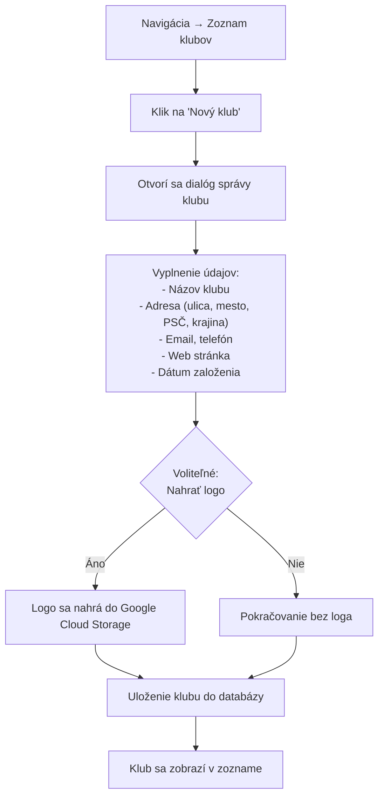
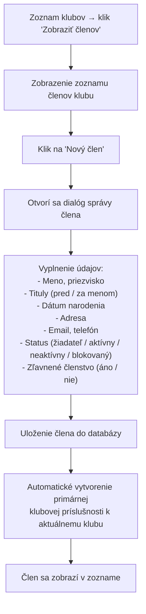
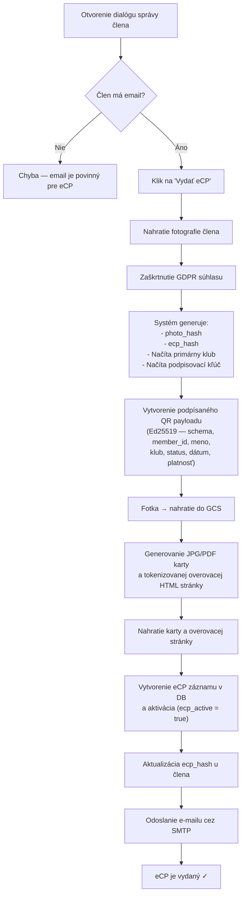
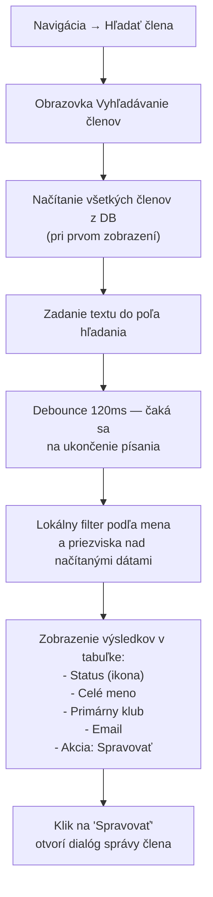
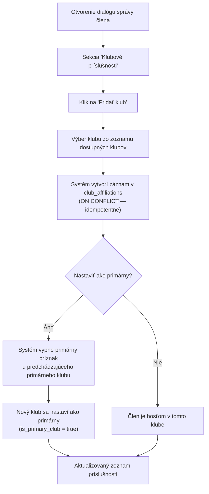
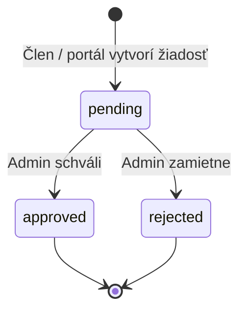
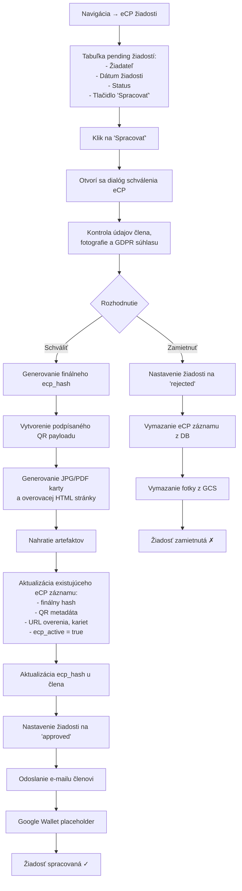
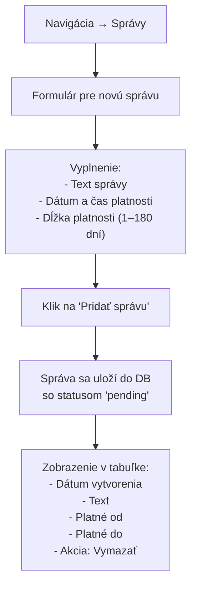
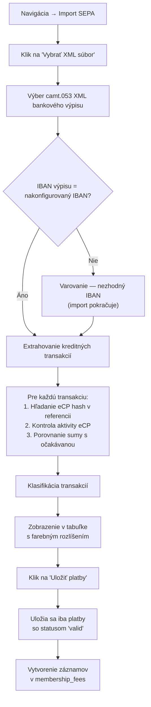
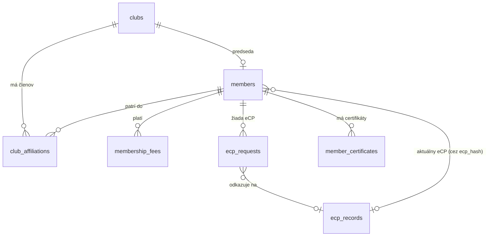

# eSpeleoSociety — Popis aplikácie

## 1. Čo je eSpeleoSociety

eSpeleoSociety je administračný systém pre Slovenskú speleologickú spoločnosť (SSS). Slúži na centralizovanú správu jaskynierskych klubov, ich členov, členských poplatkov, elektronických členských preukazov (eCP) a súvisiacej komunikácie.

Aplikácia je implementovaná ako **PyQt desktopový klient** — hrubý administračný klient, ktorý beží lokálne na počítači administrátora. Klient priamo komunikuje s PostgreSQL databázou, nahráva súbory do Google Cloud Storage a generuje digitálne podpísané eCP preukazy.

> [!NOTE]
> Aktuálna architektúra je prechodný stav. Cieľový stav predpokladá, že desktop klient sa bude pripájať výhradne na HTTPS API backend, ktorý bude vlastniť prístup k databáze, cloud úložisku, podpisovacím kľúčom a ďalším citlivým zdrojom.

---

## 2. Na čo aplikácia slúži

Aplikácia pokrýva tieto hlavné oblasti:

| Oblasť | Popis |
|---|---|
| **Správa klubov** | Vytváranie, úprava a zobrazenie jaskynierskych klubov vrátane adresy, kontaktov, predsedu a loga. |
| **Správa člena** | Vytváranie, úprava, nastavenie statusu, priradenie ku klubom cez dialog karty člena |
| **Nájst člena** | Vyhľadávanie členov a rychly pistup k jeho karte |
| **Elektronický členský preukaz (eCP)** | Priame vydanie preukazu alebo spracovanie žiadosti; generovanie podpísaného QR kódu pre offline overenie |
| **Členské poplatky** | Manuálne označenie poplatkov a poloautomatizovaný import SEPA bankových výpisov |
| **Notifikácie** | Vytváranie a správa oznamov pre členov |
| **Reporting** | Pripravené miesto pre budúce reporty a štatistiky |
| **Nastavenia** | Konfigurácia meny, výšky poplatkov, platnosti členstva, IBAN a jazyka |

---

## 3. Ako aplikácia vyzerá

### 3.1 Hlavné okno

Hlavné okno je rozdelené na dva panely:

```
┌──────────────┬──────────────────────────────────────────────┐
│  Navigácia   │           Obsahový panel                     │
│              │                                              │
│ ┌──────────┐ │  Zobrazuje aktuálne zvolenú obrazovku:       │
│ │ Kluby    │ │  - Zoznam klubov                             │
│ │ Hľadať   │ │  - Zoznam členov klubu                      │
│ │ eCP žiad.│ │  - Vyhľadávanie členov                       │
│ │ Správy   │ │  - eCP žiadosti                              │
│ │ SEPA     │ │  - SEPA import                               │
│ │ Reporting│ │  - Notifikácie                               │
│ │ Nast.    │ │  - Reporting                                 │
│ │          │ │  - Nastavenia                                │
│ │  [Logo]  │ │                                              │
│ └──────────┘ │                                              │
└──────────────┴──────────────────────────────────────────────┘
```

- **Navigačný panel** (ľavý) obsahuje tlačidlá: *Zoznam klubov*, *Hľadať člena*, *eCP žiadosti*, *Správy*, *Import SEPA*, *Reporting*, *Nastavenia* a logo organizácie.
- **Obsahový panel** (pravý) je prepínateľný stacked widget — zobrazuje vždy jednu obrazovku podľa zvolenej navigácie.
- Aplikácia sa otvára **maximalizovaná**.

### 3.2 Tabuľky

Všetky tabuľky v aplikácii majú jednotné, štandardné správanie:

- **Šírka stĺpcov** — ťahaním deliacej čiary v hlavičke; dvojklik prispôsobí obsahu.
- **Poradie stĺpcov** — ťahaním hlavičky stĺpca.
- **Zoradenie** — kliknutím na hlavičku (čísla a dátumy sa radia správne).
- **Skrývanie stĺpcov** — tlačidlo „Columns ▾" alebo pravý klik na hlavičku.
- **Zapamätanie rozloženia** — ukladá sa do `config/table_layouts.json`.

pozadovany stav: 
- samostatne tlacitko "columns" nie je potrebne. Uprava stlpcov tabulky nech ostane len na pravom kliku myskov na hociktoru bunku hlavicky
- pri inicialnom starte aplikacie sa stlpce tabuliek vzdy natiahnu tak aby zaberali celu sirku urcenej plochy (zobrazuju sa len inicialne definovane stlpce), tak aby sa neaktivovalo zobrazenie horizontalneho posuvania (ani zvacsenim okna)
- taktiez by bolo idealne keby sa sirka jednotlivych stlpcov ukladalo, aby pri prihlaseni kazdy uzivatel videl tabulku tak ako si ju nastavil posledny krat ked ju pouzival

### 3.3 Ikonky v zozname členov

V zozname členov sú statusy signalizované ikonkami:

| Ikona | Význam |
|---|---|
| ● zelený | Aktívny člen |
| ● šedý | Neaktívny člen |
| ● červený | Blokovaný člen - expomunikovany |
| ● žltý | Žiadateľ - neplati clenske do SSS |
| 🏠 | Hosť v inom ako primárnom klube |
| 👤 | Predseda klubu |
| 💰 | Zľavnené členstvo |
| 🪪 | Vydaný eCP |
| ⚠️ | Nezaplatený poplatok |

---

## 4. Procesy

### 4.1 Vytvorenie klubu



**Podrobnosti:**
1. Administrátor otvorí obrazovku **Zoznam klubov** z navigácie.
2. Klikne na tlačidlo **„Nový klub"**.
3. Otvorí sa dialóg správy klubu, kde vyplní:
   - Názov klubu (povinné)
   - Adresu — ulica, mesto, PSČ, krajina
   - Email a telefón
   - Web stránku
   - Dátum založenia
4. Voliteľne nahrá logo klubu — súbor sa uloží do Google Cloud Storage a URL sa zapíše ku klubu.
5. Predseda sa nastavuje **neskôr**, keď klub už má členov — vyberá sa zo zoznamu členov daného klubu.
6. Po uložení sa klub objaví v tabuľke klubov so stĺpcami: názov, adresa, krajina, email, predseda, počet členov.

---

### 4.2 Vytvorenie člena



**Podrobnosti:**
1. Z obrazovky **Zoznam klubov** klikne administrátor na **„Zobraziť členov"** pri konkrétnom klube.
2. V zozname členov klikne na **„Nový člen"**.
3. V dialógu vyplní osobné a kontaktné údaje.
4. Nastaví status — predvolene *žiadateľ* (`applicant`), neskôr možno zmeniť na *aktívny*, *neaktívny* alebo *blokovaný*.
5. Po uložení sa člen:
   - Vloží do tabuľky `members`.
   - Automaticky sa mu vytvorí primárna klubová príslušnosť v tabuľke `club_affiliations`.

---

### 4.3 Vydanie eCP člena (priame vydanie)



**Podrobnosti:**
1. Administrátor otvorí dialóg správy existujúceho člena.
2. Klikne na tlačidlo **„Vydať eCP"**.
3. Nahrá fotografiu člena. Systém vygeneruje `photo_hash`.
4. Zaškrtne GDPR súhlas (povinné).
5. Systém automaticky:
   - Vygeneruje unikátny `ecp_hash`.
   - Načíta primárny klub člena.
   - Načíta Ed25519 podpisovací kľúč z encrypted secrets.
   - Vytvorí podpísaný JSON QR payload obsahujúci: schema verziu, ID člena, zobrazované meno, primárny klub, status, dátum vydania, dátum platnosti, zaplatený rok, algoritmus, key ID a Ed25519 podpis.
   - Nahrá fotku do Google Cloud Storage.
   - Vygeneruje JPG a PDF kartu s QR kódom a tokenizovanú online overovaciu HTML stránku.
   - Nahrá kartu a overovaciu stránku na hosting.
   - Vytvorí záznam v tabuľke `ecp_records` a aktivuje ho.
   - Nastaví členovi aktuálny `ecp_hash`.
6. Po úspešnom vydaní sa odošle e-mail členovi cez SMTP s informáciami o preukaze, odkazmi na stiahnutie karty (JPG/PDF), online overovacou URL a odkazmi na Google Wallet a Apple Wallet.

> [!IMPORTANT]
> QR kód nie je iba náhodný token — obsahuje podpísané dáta, ktoré sa dajú overiť offline verejným kľúčom bez potreby internetového pripojenia.

**Dôležité:** token vygenerovany eCP `ecp_hash` bude sluzit ako **privatny kluc** a samotny eCP ako **digitalny doklad identity** clena SSS sluziaci pre prihlasenie do portalu SSS, portalu NDJ a pre platbu clenskeho poplatku. Overovaci QR kod na JPG/PDF karticke bude sluzit vyhradne na overenie ci ide o clena SSS. QR kod na JPG/PDF a eCP nesmu byt generovane rovnakym algorytmom! Pri overovani clena cez QR kod JPG/PDF sa zobrazi len karticka z ktorej kod bol oskenovany (s fotografiou a menom, klubovou prislusnostou, rokom narodenia, mestom bydliska a informaciou ci bolo clenske zaplatene na aktualny rok, dalej budu zobrazene linky na dokumenty ako vynimky alebo stanovy SSS a podobne). Pri oskenovani QR kodu z eCP sa zobrazi nie karticka ale interaktivne rozhranie, kde budu zobrazene vsetky informacie ako pri klasickom QR code. 

---

### 4.4 Vyhľadanie člena



**Podrobnosti:**
1. Administrátor otvorí obrazovku **Hľadať člena** z navigácie.
2. Pri prvom zobrazení sa načítajú všetci členovia z databázy do pamäte.
3. Zadaním textu do poľa hľadania sa po 120ms debounce spustí lokálny filter podľa mena a priezviska.
4. Zobrazí sa maximálne 300 výsledkov — pri väčšom počte sa zobrazí výzva na spresnenie hľadania.
5. Kliknutím na **„Spravovať"** pri konkrétnom členovi sa otvorí dialóg správy člena.
6. Po zatvorení dialógu sa zoznam automaticky obnoví.

**Poznamka**: pre znizenie zatazenia komunikacie so serverom (clenov je priblizne 1000) je potrebne tento zoznam strankovat, po 25 az 50 clenov naraz, preto je potrebne zaviest strankovaciu navigaciu pre tuto tabulku. Realizovanie tejto funkcionality navrhujem umiestnit plochu o vyske jedneho riadka pod plochu tabulky s navigacnymi prvkami: na zaciatok, dopredu, pocet zobrazenych zaznamov na stranku, dozadu, na koniec.

---

### 4.5 Priradenie člena ku klubu



**Podrobnosti:**
1. V dialógu správy člena je sekcia **Klubové príslušnosti**.
2. Administrátor pridá novú príslušnosť výberom klubu.
3. Systém vytvorí záznam v tabuľke `club_affiliations` — ak príslušnosť už existuje, operácia je oznacena ako (`ON CONFLICT`).
4. Člen môže patriť do **viacerých** klubov, ale iba **jeden** je primárny - za ktory plati clenske do SSS.
5. Pri zmene primárneho klubu systém automaticky vypne príznak `is_primary_club` u predchádzajúceho primárneho klubu.
6. Člen v neprimárnom klube sa zobrazuje ako **hosť** (ikona 🏠).
7. Administrátor môže príslušnosť aj odstrániť.

> [!NOTE]
> Databáza vynucuje, aby člen mal maximálne jeden primárny klub — cez unikátny partial index na `club_affiliations.member_id` kde `is_primary_club = true`.
Pre nezaradenych clenov bude zalozeny automaticky virtualny klub "nezaradeny" ale clen musi byt niekam zaradeny a tento virtualny klub bude nutne vybrat manualne.

---

### 4.6 Spracovanie eCP žiadostí

#### 4.6.1 Životný cyklus eCP žiadosti



#### 4.6.2 Schválenie žiadosti



**Poznamka:** Databaza clenov bude naplnena dopredu, clenovia ktory si budu chciet vybavit eCP budu musiet zalozit ziadost cez portal SSS. Na portaly vyplnia do formularu meno, priezvisko, datum narodenia, klub a email. Udaje sa porovnaju s databazou. Ak email nie je v databaze posle sa overovaci email s kodom. Po overeni emailu sa ulozi tento email do databazy a proces pokracuje nahratim fotografie. Po nahrati fotografie sa odosle na email informacia o zaregistrovani ziadosti. Tento proces nepatri do samotnej aplikacie eSpeleoSociety, ale je to sucast procesov a je potrebne na to mysliet pri vyvoji.

#### 4.6.3 Zamietnutie žiadosti

Pri zamietnutí sa:
1. Žiadosť nastaví na status `rejected`.
2. Súvisiaci eCP záznam sa vymaže z databázy.
3. Fotografia sa vymaže z Google Cloud Storage.
4. Dialóg sa zatvorí.

**Poznamka:** o zruseni ziadosti sa odosle informacia na email. V informacnom emaile pri zadani ziadosti sa prilozi aj linka na zrusenie ziadosti ziadatelom. 

---

### 4.7 Notifikácie v eCP

Notifikačný systém v eSpeleoSociety má dve časti:

#### 4.7.1 Správy pre členov (obrazovka „Správy")



**Podrobnosti:**
- Administrátor zadá text správy, dátum a čas začiatku platnosti a dĺžku platnosti (1, 2, 3, 4, 5, 6, 7, 10, 14, 21, 30, 60, 120 alebo 180 dní).
- Systém automaticky vypočíta dátum exspirácie.
- Správy sa ukladajú do tabuľky `notifications`.
- Aktuálne ide o **evidenciu správ** — distribučný mechanizmus (e-mail, push notifikácie, portál) zatiaľ nie je implementovaný.

#### 4.7.2 E-mailové notifikácie pri eCP

E-mailová notifikácia sa odosiela automaticky po:
- **Priamom vydaní eCP** z dialógu správy člena.
- **Schválení eCP žiadosti** z obrazovky eCP žiadostí.
- **Zruseni eCP žiadosti** z obrazovky eCP žiadostí.

**Obsah e-mailu:**

| Prvok | Popis |
|---|---|
| Oslovenie | Celé meno člena vrátane titulov |
| Informácia | Notifikácia o vystavení eCP |
| Členské ID | ID člena z QR payloadu |
| Klub | Primárny klub člena |
| Platnosť | Dátum platnosti preukazu |
| Online overenie | URL na tokenizovanú overovaciu stránku |
| Stiahnutie | Odkazy na JPG a PDF kartu |
| Digital Wallet | Tlačidlá „Pridať do Google Wallet" a „Pridať do Apple Wallet" |
| Právny dokument | Odkaz na všeobecnú výnimku MŽP SR |
| Prílohy | Voliteľne JPG a PDF karta ako prílohy |

E-mail sa odosiela cez SMTP (STARTTLS na porte 587 alebo SSL na porte 465). Konfigurácia je uložená v encrypted secrets.

> [!WARNING]
> Zlyhanie odoslania e-mailu sa zobrazí iba ako varovanie — nespôsobí rollback už vydaného eCP. Neexistuje e-mailový outbox, retry mechanizmus ani história doručenia. Toto je prechodné riešenie — v cieľovej architektúre bude e-maily odosielať backend.

---

### 4.8 Poloautomatizované párovanie členských poplatkov (SEPA import)



#### Klasifikácia transakcií

Systém každú kreditnú transakciu automaticky klasifikuje:

| Status | Farba | Význam |
|---|---|---|
| `valid` | 🟢 Zelená | Známy aktívny eCP, presná očakávaná suma |
| `underpaid` | 🟡 Žltá | Známy aktívny eCP, suma je nižšia |
| `overpaid` | 🟡 Žltá | Známy aktívny eCP, suma je vyššia |
| `inactive_expected_amount` | 🟠 Oranžová | eCP nie je aktívny, ale suma sedí |
| `inactive_wrong_amount` | 🟠 Oranžová | eCP nie je aktívny a suma nesedí |
| `unknown_reference_expected_amount` | 🔵 Modrá | Referencia nie je známa, ale suma vyzerá ako poplatok |
| `unknown_reference_wrong_amount` | ⚪ Šedá | Referencia nie je známa a suma nesedí |
| `invalid_amount` | 🔴 Červená | Suma sa nedá spracovať |

**Postup:**
1. Administrátor otvorí obrazovku **Import SEPA** z navigácie.
2. Klikne na **„Vybrať XML súbor"** a vyberie bankový výpis vo formáte camt.053.
3. Systém overí IBAN výpisu voči nakonfigurovanému IBAN organizácie.
4. Z XML extrahuje kreditné transakcie a pre každú:
   - Hľadá platobný hash (platobny hash je generovany z eCP hash a roku na ktory sa vztahuje platba) v referenčnom poli transakcie (remittance alebo EndToEndId).
   - Ak nájde platobny hash, overí, či eCP existuje v databáze a je aktívny.
   - Porovná sumu s očakávanou (štandardný alebo zľavnený poplatok).
5. Transakcie sa zobrazia v tabuľke s farebným rozlíšením podľa statusu.
6. Administrátor klikne na **„Uložiť platby"** — uložia sa iba transakcie so statusom `valid`.
7. Pre každú validnú platbu sa vytvorí záznam v tabuľke `membership_fees` s:
   - ID člena
   - Aktuálnym rokom
   - Šifrovanou platobnou referenciou

> [!NOTE]
> Systém aktuálne nemá workflow pre ručné párovanie neznámych platieb. Platby, ktoré sa nedajú automaticky priradiť. Po manualnom identifikovani platby sa zaplatenie oznaci priamo v karte clena. Alternativne sa v prehlade clenov klubu mozu oznacit jeho clenovia a pridelit im priznak o zaplateni naraz.
> [!NOTE]
> generovanie a publikovanie platobneho linku prebieha naraz manualnou akciou v aplikacii pre vsetkych drzitelov eCP. Touto akciou sa v eCP kazdeho drzitela objavi linka pre platbu, ktora otvori bankovu aplikaciu na zariadeni. Po prijati platby a jej zaregistrovani v eSpeleoSocity sa linka v eCP odstrani a clenovi pride email o zaplateni poplatku.
Je potrebne analyzovat ci je nutne posielat spravu aj pri manualnom zadani uhradenia poplatku v karte clena alebo hromadne.

---

### 4.9 Reporting

Obrazovka **Reporting** je aktuálne pripravená ako prázdny placeholder pre budúce reporty a štatistiky.

**Plánované reporty:**

| Report | Popis |
|---|---|
| **Prehľad členov** | Štatistiky počtu aktívnych / neaktívnych / blokovaných členov podľa klubov |
| **Platobná disciplína** | Prehľad zaplatených / nezaplatených poplatkov za aktuálny rok |
| **eCP štatistiky** | Počet vydaných, aktívnych, expirovaných preukazov |
| **Klubové štatistiky** | Počet členov na klub, predsedovia, dátumy založenia |
| **SEPA import história** | Prehľad importovaných výpisov a spárovaných platieb |
| **Auditný log** | Zobrazenie záznamov o operáciách v systéme |

> [!TIP]
> Reporting bude slúžiť na rýchly prehľad stavu organizácie, identifikáciu nezaplatených poplatkov, kontrolu platnosti eCP a prípravu podkladov pre vedenie SSS.

---

## 5. Prehľad dátového modelu



---

## 6. Bezpečnostný model

### Aktuálne ochrany
- Secrets súbor je lokálne šifrovaný PIN-om (PBKDF2 + AES-CBC).
- Dátum narodenia je šifrovaný v databáze.
- Auditné logy redigujú citlivé údaje (eCP hash, fotka, dátum narodenia, email, telefón, adresa).
- eCP QR kód je podpísaný asymetrickým kľúčom Ed25519.
- Offline skener overuje iba verejným kľúčom.

### Cieľová architektúra

```
Desktop admin klient  ───→ HTTPS API ───→ PostgreSQL
Portál člena           ───→ HTTPS API ───→ Google Cloud Storage
Portál predsedu        ───→ HTTPS API ───→ Google Wallet
Offline QR skener      ───→ Verejný kľúč (bez internetu)
```

---

## 7. Slovník pojmov

| Pojem | Význam |
|---|---|
| **eCP** | Elektronický členský preukaz |
| **eCP hash** | Unikátny token/identifikátor preukazu, slúži aj ako platobná referencia |
| **eCP record** | Databázový záznam s fotkou, aktivitou, QR metadátami a stavom Wallet |
| **eCP request** | Žiadosť o vydanie eCP |
| **QR payload** | JSON dáta zakódované v QR kóde, podpísané Ed25519 |
| **GCS** | Google Cloud Storage — úložisko pre fotky, logá a karty |
| **SEPA camt.053** | XML formát bankového výpisu používaný na import platieb |
| **SSS** | Slovenská speleologická spoločnosť |
| **GDPR** | Súhlas so spracovaním osobných údajov |
